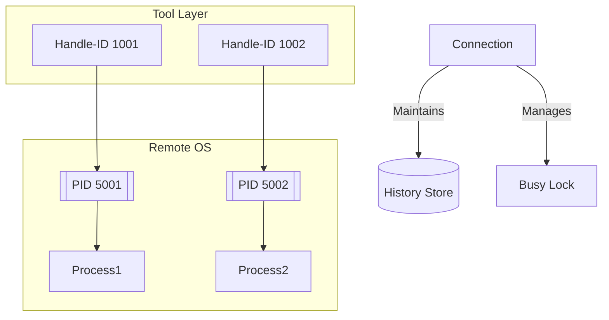

# SSH Command Process Management

## Key Identifiers and Their Relationships

### Handle-ID
- **Purpose**: Tool-level command tracking
- **Characteristics**:
  - Unique per command execution
  - Sequential within a connection
  - Persistent in command history
  - Invalidated on connection drop
- **Used For**:
  - Retrieving command output
  - Checking execution status
  - Accessing historical commands

### Process ID (PID)
- **Purpose**: OS-level process identification
- **Characteristics**:
  - Assigned by remote OS kernel
  - Ephemeral (exists only while process runs)
  - Unique system-wide
  - Recycled by OS after process ends
- **Used For**:
  - Process management (signals, monitoring)
  - System-level debugging
  - Resource tracking

### Connection
- **Purpose**: Session management
- **Manages**:
  - Handle-ID ↔ PID mapping
  - Execution lock (BusyError)
  - Command history persistence
  - Resource cleanup

---

## Command Execution Scenarios

### 1. Sequential Execution
```bash
# Local terminal example
$ command1 ; command2 ; command3
```
```python
# SSH tool equivalent
await ssh_cmd_run("command1")  # Handle-ID: 1001, PID: 5001
await ssh_cmd_run("command2")  # Handle-ID: 1002, PID: 5002 
await ssh_cmd_run("command3")  # Handle-ID: 1003, PID: 5003
```
- New Handle-ID **and** PID for each command
- Commands execute sequentially
- BusyError prevents overlap

### 2. Parallel Execution
```bash
# Local terminal example
$ command1 & command2 & command3 &
```
```python
# SSH tool equivalent
# Requires separate connections or async handling
async with Client(mcp) as client1, Client(mcp) as client2, Client(mcp) as client3:
    await asyncio.gather(
        client1.call_tool("ssh_cmd_run", {"command": "command1"}),
        client2.call_tool("ssh_cmd_run", {"command": "command2"}),
        client3.call_tool("ssh_cmd_run", {"command": "command3"})
    )
```
- Concurrent Handle-IDs and PIDs
- Requires multiple connections
- No BusyError between connections

### 3. Pipeline Execution
```bash
# Local terminal example
$ command1 | command2 | command3
```
```python
# SSH tool equivalent
# Execute as single compound command
await ssh_cmd_run("command1 | command2 | command3")  # Handle-ID: 1004, PID: 5004
```
- Single Handle-ID/PID for pipeline
- All commands share same execution context
- Output captured as combined stream

---

## Identifier Relationships


---

## Orphaned Processes
**Scenario**: Network disconnect during command execution  
**Result**:
- Handle-ID invalidated (connection-specific)
- PID continues running on remote OS  
**Resolution**:
1. Reconnect and check with:
   ```python
   await ssh_cmd_history(limit=10)  # Find last Handle-ID
   ```
2. If process still running:
   ```python
   await ssh_task_kill(pid=5001)  # Use discovered PID
   ```

---

## FAQ

**Q: Can multiple Handle-IDs reference the same PID?**  
A: Only if:
- Process survives connection drop/reconnect
- Manual PID reuse (rare)

**Q: How are PIDs assigned?**  
A: By remote OS kernel, independent of Handle-IDs

**Q: What's the maximum Handle-ID value?**  
A: Depends on connection duration - sequential per session

**Q: How to track processes across connections?**  
A: Use PID with `ssh_task_status(pid)` across sessions
