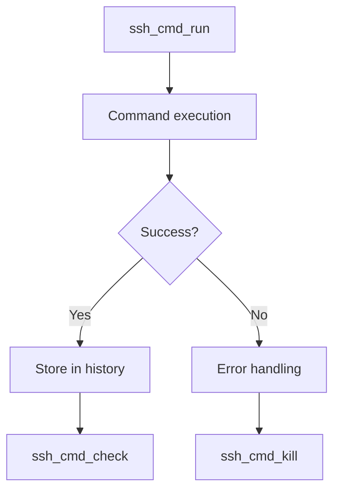

# SSH Command Execution Tools Documentation

## Core Tool Overview

### ssh_cmd_run (Primary Tool)
- Executes commands on remote host
- Handles both immediate and long-running operations
- Manages timeouts (I/O and runtime)
- Returns structured response with:
  - Command output
  - Execution metadata (PID, timestamps)
  - Status indicators (success/timeout/failure)

### Supporting Tools
- `ssh_cmd_check`: Monitors long-running command status
- `ssh_cmd_kill`: Terminates running commands
- `ssh_cmd_history`: Retrieves command execution records

---

## Test Sequence & Flow

1. **Basic Validation** (`test_ssh_run_basic`)
   - Simple "echo" command verification
   - Checks success status, output capture, and metadata integrity

2. **Output Handling** (`test_ssh_run_multiline`)
   - Verifies multi-line output capture
   - Tests buffer management and line counting

3. **Error Conditions** (`test_ssh_run_failure`)
   - Forces command failure (exit code 42)
   - Validates error reporting and status propagation

4. **Asynchronous Monitoring** (`test_ssh_cmd_check`)
   - Tests status polling mechanism
   - Verifies transition from running->completed states

5. **Concurrency Control** (`test_ssh_busy_lock`)
   - Ensures single-command-at-a-time enforcement
   - Validates BusyError handling

6. **Timeout Handling** (`test_ssh_runtime_timeout`)
   - Verifies automatic process termination
   - Tests cleanup and post-timeout system availability

7. **Manual Intervention** (`test_ssh_manual_interrupt`)
   - Combines timeout detection with manual kill
   - Tests PID tracking and process management

---

## Key Interdependencies

### Execution Flow

### Data Flow
- All tools share the command history store
- PID tracking links execution->monitoring->termination
- Status codes propagate through response chain

---

## Error Conditions & Handling

| Scenario               | Error Type            | Handling Mechanism             | Status Code           |
|------------------------|-----------------------|---------------------------------|-----------------------|
| Command failure        | Non-zero exit code    | CommandFailed wrapper          | 'command_failed'      |
| I/O timeout            | No output activity    | Background thread monitoring   | 'io_timeout'          |
| Runtime timeout        | Process over duration | SIGTERM/SIGKILL sequence        | 'runtime_timeout'     |
| Concurrent execution   | Lock contention       | Threading.Lock primitive        | 'busy'                |
| Sudo requirements      | Privilege escalation  | Pre-execution sudo check        | 'sudo_required'       |
| Process termination    | Manual intervention   | Signal-based termination       | 'killed'/'terminated' |

---

## Implementation Details

1. **Timeout Prioritisation**
   - Runtime timeout supersedes I/O timeout if both set
   - Background thread monitors wall-clock duration

2. **Output Management**
   - Circular buffer with tail preservation (default 100 lines)
   - Streaming output capture with line normalisation

3. **State Tracking**
   - Atomic status updates to prevent race conditions
   - PID-based process lifecycle management

4. **Cleanup Guarantees**
   - Context managers ensure resource release
   - SIGKILL fallback for unresponsive processes
